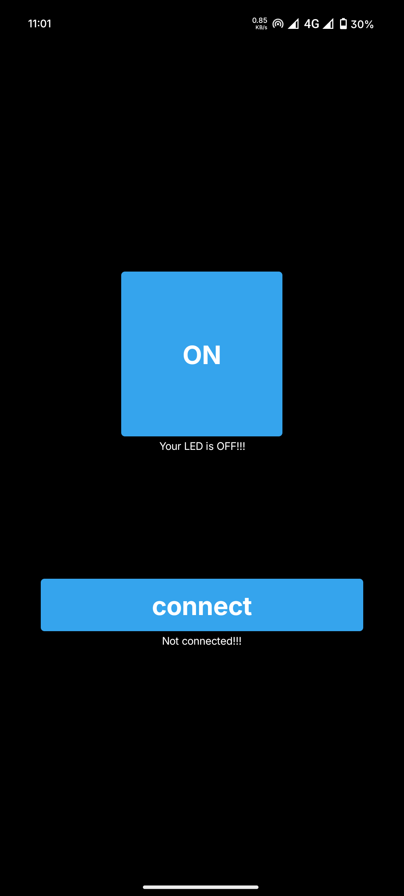
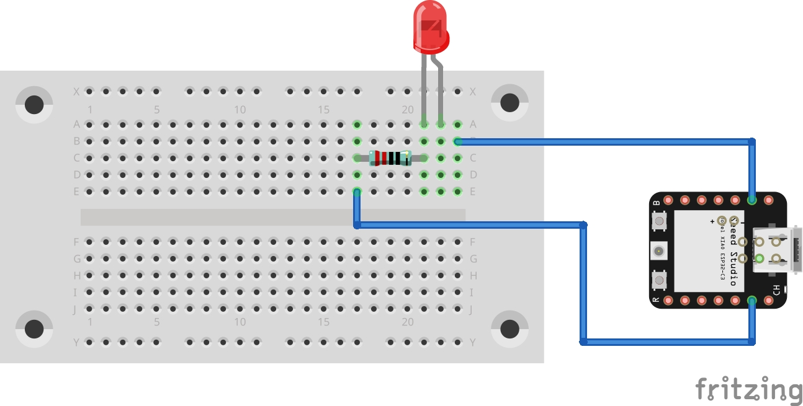
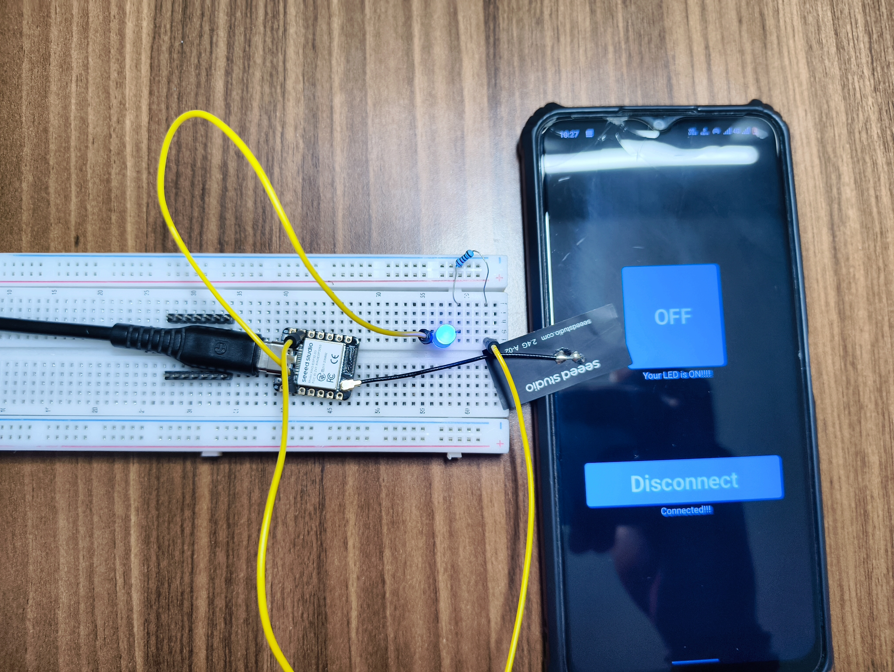

<p align="center">
    
</p>
<p align="center">
  <h1 align="center">ESP32S3_Bluetooth_LED</h1>
</p>
<p align="center">
  <em><code>❯ BLE-controlled LED with ESP32-S3 + Android App</code></em>
</p>
<p align="center">
  
  
  
</p>

---

# ESP32S3_Bluetooth_LED

Control an LED on your ESP32-S3 board using Bluetooth Low Energy (BLE). This project includes both the firmware and a custom Android app made using MIT App Inventor.

---

## 📋 Table of Contents

- [About](#about)
- [Features](#features)
- [Requirements](#requirements)
- [Installation](#installation)
- [Usage](#usage)
- [MIT App Inventor App](#mit-app-inventor-app)
- [Circuit Diagram](#circuit-diagram)
- [Project Structure](#project-structure)
- [Author](#author)

---

## About

This project sets up a BLE server on the ESP32-S3 using the `NimBLE` library. The device advertises itself as `XIAO-LED`. When connected, you can send messages like `on` or `off` via BLE, and the ESP32 will control the LED accordingly.

---

## Features

- BLE server with custom service/characteristic
- Accepts write messages from BLE clients
- LED turns ON/OFF based on BLE message
- Serial monitor prints all received BLE data
- Simple Android app for control

---

## Requirements

- **Hardware**:
  - ESP32-S3 (e.g. Seeed Studio XIAO ESP32S3)
  - LED (or onboard LED on GPIO 2)

- **Software**:
  - VS Code + PlatformIO
  - MIT App Inventor (for Android app)

---

## Installation

1. Clone the repository:
```sh
❯ git clone https://github.com/Neil-Tomar/ESP32S3_Bluetooth_LED
❯ cd ESP32S3_Bluetooth_LED
```

2. Open in VS Code with PlatformIO

3. Connect ESP32-S3 via USB

4. Upload the code

5. Open Serial Monitor (Baud: `115200`)

---

## Usage

- Power on the ESP32-S3
- Open the custom Android app (see below)
- Connect to device named `XIAO-LED`
- Use ON/OFF buttons to send commands
- LED should respond immediately

BLE Commands:
- Send `on` → LED ON
- Send `off` → LED OFF

Serial Output Example:
```
BLE LED Ready
BLE Client Connected
Received: on
LED ON
```

## 🔌 How Bluetooth Works

- **BLE Server (ESP32)**: The ESP32 acts as a BLE server. It advertises a service with a unique UUID (`6e400001-b5a3-f393-e0a9-e50e24dcca9e`). Inside this service is a characteristic with UUID `abcd1234-5678-90ab-cdef-1234567890ab` that supports `WRITE` operations.

- **BLE Client (Android App)**: The Android app connects to the ESP32, locates the characteristic, and writes simple strings like `"on"` or `"off"` to control the LED.

- **Callbacks**: When data is written to the BLE characteristic, the ESP32 triggers a callback (`onWrite`) to parse the command. If `"on"` is found, the LED is turned ON. If `"off"` is found, it turns OFF.

- **Connection Events**: The code also logs when the BLE client connects or disconnects.

---

## MIT App Inventor App

This project includes a custom Android app made using [MIT App Inventor](https://appinventor.mit.edu/):

- Connects to BLE device `XIAO-LED`
- Sends text command `on` or `off` when buttons are pressed
- Simple UI with two buttons

You can export the `.aia` file and customize the app easily.

---

## 📱 App Screenshots<p align="center">
  ### Application
  
</p>


---
## 🧩 Circuit Diagram


- GPIO 2 → 220Ω resistor → LED anode
- LED cathode → GND

If your board has an onboard LED, no wiring needed.
<br/>
<br/>
<br/>
<br/>
<br/>
<video autoplay src="images/Circuit_setup_video.mp4" alt="App Screenshot 1" width="45%"><br/>

---

## Project Structure

```
ESP32S3_Bluetooth_LED/
├── src/
│   └── main.cpp         # BLE LED control firmware
├── app/
│   └── bluetooth_app.aia # MIT App Inventor project
├── images/              # Upload UI + circuit photos
├── platformio.ini       # PlatformIO config
└── README.md            # This file
```

---

## 👨‍💻 Author

Made by **Neil Tomar**.

This is a BLE LED control project using ESP32-S3 and a custom Android app. Entire project and UI designed from scratch.
